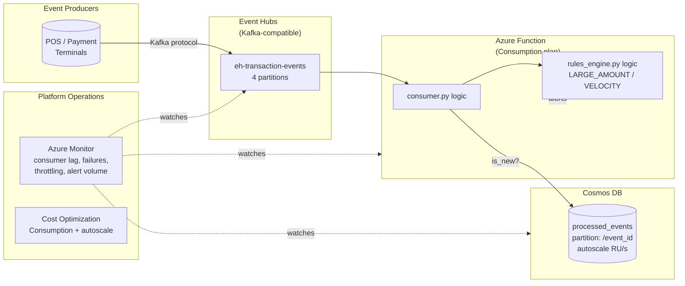

# Real-Time Transaction Monitoring & Risk Detection Platform


**[← Back to live portfolio](https://andiswamatai.github.io)**

## 🧠 Business Context

Financial institutions process millions of transactions daily across multiple channels including cards, EFT, digital banking, and cross-border payments.

In such environments, ensuring transactional integrity and detecting fraudulent or suspicious activity in near real-time is critical.

Key challenges include:

- High-velocity transaction streams from multiple sources
- Duplicate or replayed events due to network retries
- Lack of consistent transaction identity across systems
- Increasing sophistication of fraud patterns
- Regulatory pressure for real-time monitoring and reporting

  ---
  
## 🎯 Solution Overview

This platform implements a real-time transaction monitoring and risk detection system designed to simulate enterprise-grade financial crime monitoring architecture.

The system provides:

- Event-driven ingestion layer for transaction streams
- Idempotency controls to eliminate duplicate transactions
- Pluggable rule-based risk detection engine
- Structured enrichment of transaction events
- Monitoring-ready outputs for downstream analytics and alerting systems
  
---

## Architecture

📡 Transaction Sources
- Payment Gateway Events
- Banking Transactions
- Card Swipes / Digital Payments

        ↓

⚡ Ingestion Layer
- Event Stream Capture (Kafka-style simulation)
- Deduplication (idempotency key logic)

        ↓

🔄 Processing Layer
- Spark-style transformations
- Transaction enrichment
- Rule engine evaluation

        ↓

🧠 Risk Engine
- Fraud rules engine (pluggable)
- Velocity checks
- Threshold anomalies
- Behavioural flags

        ↓

📊 Output Layer
- Alerts dataset
- Risk scored transactions
- Monitoring dashboards (Power BI / logs)

  ---

| Component | File | Responsibility |
|---|---|---|
| Event producer | `src/event_producer.py` | Simulates an at-least-once event stream, including deliberate duplicate deliveries |
| Dedup store | `src/dedup_store.py` | Tracks processed `event_id`s so re-reads/replays never double-process |
| Rules engine | `src/rules_engine.py` | Pluggable fraud/anomaly rules (large amount, velocity/burst detection) |
| Consumer | `src/consumer.py` | Reads events in event-time order, applies idempotency, runs rules, reports data quality |

> This uses a file-based stream rather than a live Kafka broker so the project runs anywhere with no infrastructure to stand up — the idempotency and ordering logic is identical to what you'd write against a real Kafka consumer; only the transport changes.

## Tech stack

Python, SQLite, JSON Lines (the file format that maps directly onto how Kafka messages are typically logged/replayed).

## Running it

```bash
python src/event_producer.py   # generates data/events.jsonl, ~500 events incl. duplicates
python src/consumer.py
```

Sample output:

```
Events read:          515
Duplicates skipped:   15
Net events processed: 500
Completeness:         100.00%
Alerts raised:        39
   VELOCITY: 18
   LARGE_AMOUNT: 21
```

Run the tests:

```bash
python -m unittest discover -s tests -v
```

## Production Architecture

This repo now ships the full event-driven production footprint: Event Hubs (Kafka-compatible), an Azure Function running the consumer/rules engine, Cosmos DB as the distributed idempotency store, and monitoring + cost controls — provisioned via Terraform.



## What's actually runnable vs. what's reference architecture

| Component | Status |
|---|---|
| `src/*.py` — producer, dedup store, rules engine, consumer | **Runs locally**, no Azure account needed |
| `tests/` | **Runs locally**, 6 passing unit tests |
| `cost_optimization/cost_calculator.py` | **Runs locally**, models real savings (~R283K/year) |
| `terraform/*.tf` | **Valid HCL**, `terraform validate`-able, not applied (no Azure subscription) |
| `monitoring/alert_rules.tf` | **Valid HCL**, 4 alert tiers tuned for a fraud-detection workload |
| `.github/workflows/cd.yml` | **Documents the real deployment commands**, doesn't execute against live infra |

## Production readiness checklist

- [x] Infrastructure as Code (Terraform, environment-separated via `.tfvars`)
- [x] CI/CD (GitHub Actions: test → Terraform plan → deploy)
- [x] Event-driven, Kafka-compatible ingestion (Event Hubs) — real producers need zero code changes
- [x] Distributed idempotency store (Cosmos DB) — the local SQLite store doesn't work across concurrent Function instances, Cosmos does
- [x] Monitoring & alerting (4 tiers: consumer lag, function failures, Cosmos throttling, alert-volume anomaly)
- [x] Cost optimization (Functions Consumption plan, Cosmos + Event Hubs autoscale — all measured, ~84% savings vs always-on sizing)
- [x] Secrets via Key Vault, Function App uses managed identity for Cosmos access
- [x] Least-privilege Event Hub authorization rule (listen-only for the consumer)

## What I'd add next

- Swap the file-based local producer for `confluent-kafka-python` pointed at the real Event Hubs Kafka endpoint, keeping `dedup_store.py` and `rules_engine.py` unchanged.
- Stream alerts to a case-management queue (Service Bus) instead of a flat file, with severity scoring and analyst feedback loops.
- Add the Cosmos DB Data Contributor role assignment noted in `terraform/cosmos_and_function.tf` once deployed against a live subscription.

## License

MIT — feel free to reuse for your own learning
